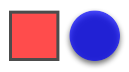
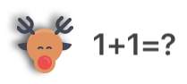
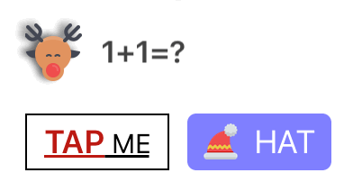
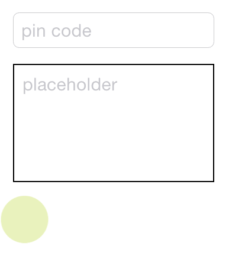
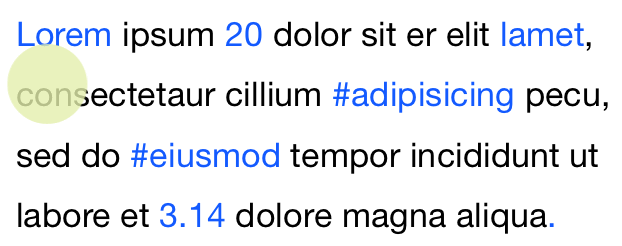
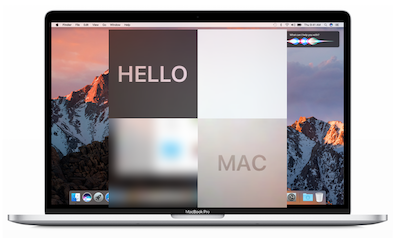
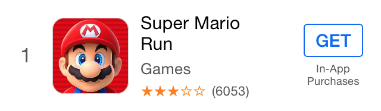
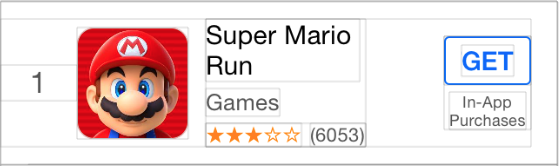

# NerdyUI

   
An easy way to create and layout UI components for iOS 8 and above.

---
## Macros for create Strings, Fonts, Colors, Images and Common structs.

You can convert nearly everything to NSString by using `Str()` macro.  
Similarly, you can log variables using `Log()` macro.

	Str(100);					//@"100"
	Str(3.14);					//@"3.14"
	Str(@0.618);				//@"0.618"
	Str(view.frame);			//@"{{0, 0}, {100, 100}}"
	Str(view.center);			//@"50, 50}"
	Str(_cmd);					//@"viewDidLoad"
	Str(NSString.class);		//@"NSString"
	Str("c string");			//@"c string"
	Str(@"name: %@", name);		//@"name: xxx"

	Log(100);
	Log(3.14);
	Log(@0.618);
	Log(view.frame);
	...
	Log(@"name: %@", name);
	
You can create NSAttributedString with `AttStr()` macro.

	AttStr(@"hello, 101").match(@"[0-9]+").underline;
	AttStr(@"A smile ", Img(@"smile"), @" !!");		//attributedString with image attachment
	
You can create UIFont with `Fnt()` macro.

	Fnt(15);					//[UIFont systemFontOfSize:15]
	Fnt(@15);					//[UIFont boldSystemFontOfSize:15]
	Fnt(@"body");				//UIFontTextStyleBody
	Fnt(@"Helvetica,15");		//helvetica font with size 15
	
You can create UIColor with `Color()` macro.

	Color(@"red");				//[UIColor redColor]
	Color(@"green,0.5");		//green color with 0.5 alpha
	Color(@"0,0,255");			//blue color
	Color(@"#0000FF");			//blue color
	Color(@"random");			//random color
	
You can create UIImage with `Img()` macro.

	Img(@"imageName");			//[UIImage imageNamed:]
	Img(@"#imageName");			//prefixed with # will return an stretchable image
	Img(@"red");				//1x1 square image with red color
	
You also can create CGPoint, CGSize, CGRect, NSRange and UIEdgeInsets with `XY()`, `WH()`, `XYWH()`, `Range()`, `Insets()` macros.

	CGPoint		p = XY(20, 20);
	CGSize	 	s = WH(50, 50);
	
	CGRect	 	f1 = XYWH(20, 20, 50, 50);
	CGRect		f2 = XYWH(f1.origin, f1.size);
	CGRect		f3 = XYWH(f2.origin, 50, 50);
	CGRect		f4 = XYWH(20, 20, f3.size);
	
	NSRange		r = Range(10, 20);
	
	UIEdgeInsets i1 = Insets(10);				//{10, 10, 10, 10}
	UIEdgeInsets i2 = Insets(10, 20);			//{10, 20, 10, 20}
	UIEdgeInsets i3 = Insets(10, 20, 30);		//{10, 20, 30, 20}
	UIEdgeInsets i4 = Insets(10, 20, 30, 40);	//{10, 20, 30, 40}
	
These macros exist not only because they simplify the process of creating common types, but also indicate a new way of setting properties as you will see soon.

## Easy way to access frame property

	someView.x = 10;
	someView.y = someView.x;
	someView.xy = XY(10, 10);
	someView.w = 50;				//width
	someView.h = someView.w;		//height
	someView.wh = WH(50, 50);
	someView.frame = XYWH(10, 10, 50, 50);
	
	someView.cx = 25;
	someView.cy = someView.cx;
	someView.center = XY(25, 25);
	
	someView.maxX = 60;
	someView.maxY = someView.maxX;
	someView.maxXY = XY(60, 60);

## Easy way to set up UI components.
NerdyUI make it very easy to create UI components and config properties by using a chaining syntax.

	UIView *view1 = View.xywh(20, 30, 50, 50).bgColor(@"red").opacity(0.7).border(3, @"3d3d3d");
    UIView *view2 = View.xy(80, 30).wh(view1.wh).bgColor(@"blue,0.7").cornerRadius(25).shadow(0.8).onClick(^{
        Log(@"view2");
    });

	UIView *moose = ImageView.img(@"moose").x(20).y(100).shadow(0.6, 2, -3, -1);
    UILabel *quiz = Label.str(@"%d+%d=?", 1, 1).fnt(@17).color(@"66,66,66").fitSize.x(moose.maxX + 10).cy(moose.cy);

	id title = AttStr(@"TAP ME").fnt(15).underline.range(0, 3).fnt(@18).color(@"random");
    UIButton *button1 = Button.str(title).insets(5, 10).fitSize.border(1).xy(20, 150).onClick(^(UIButton *btn) {
    	//Exp allows you to execute codes in any position.
        quiz.text = Str(@"%d+%d=%d", 1, 1, Exp(btn.tag += 1)); 
        [quiz sizeToFit];
    });
    
    UIButton *button2 = Button.str(@"HAT").highColor(@"brown").img(@"hat").gap(8);
    button2.xywh(button1.frame).x(button1.maxX + 10).cornerRadius(5).bgImg(@"blue,0.5").highBgImg(@"orange");
    //highBgImg with color string is a very useful trick to set highlighted background color for UIButton.
    

    id pinField = TextField.x(button1.x).y(button1.maxY + 15).wh(170, 30).onChange(^(NSString *text) {
    	//self has been weakified, no need to warry about retain cycle.
        [(id)[self.view viewWithTag:101] setText:text];
    }).numberKeyboard.maxLength(4).pstr(@"pin code").fnt(15).roundStyle;
    
    id textView = TextView.xywh(20, 240, 170, 100).border(1).insets(8).pstr(@"placeholder").fnt([pinField font]).tg(101);

As you can see, most of the chainable properties are quite straight forward and self-explained.   
Some of them are very versatile and can take many kind of arguments.

You use `.opacity()` and `.tg()` to set view's alpha and tag.

You use `.x()`, `.y()`, `.xy()`, `.w()`, `.h()`, `.wh()`, `.xywh()`, `.cx()`, `.cy()`, `.cxy()`, `.maxX()`, `.maxY()`, `.maxXY()` to set view's position and size. 

You use `.fnt()` to set font with the same format as `Fnt()`.

You use `.str()` to set text or attribtedText with the same format as `Str()`.

You use `.img()`, `.highImg()`, `.bgImg()` and `.highBgImg()` to set image, highlighted image, backgroundImage and highlighted backgroundImage, with the same format as `Img()`.

You use `.color()`, `.bgColor()`, `.highColor()` to set text color, background color and highlighted text color, with the same format as `Color()`.

You use `.border()`, `.cornerRadius()` and `.shadow()` to config border styles and drop shadows.

You use `.fitWidth`, `.fitHeight` and `.fitSize` to change bounds to fit content.

You use `.onClick()` to add click handler to any UIView.

For UITextField and UITextView, you use `.pstr()` to set placeholder, `.maxLength()` to limit the total length, `.onChange()` for adding text change handler.

For UIButton, UITextField and UITextView, you use `.insets()` to add padding to contents.

An there are many more.
Check the corresponding header file for more information.

##Enhancements to UILabel
You can add line spacing to UILabel by simply use `.lineGap()`.

You can add link to UILabel as well. All you have to do is create an NSAttributedString that marked as `.linkForLabel`, and then add a link click handler to UILabel with `.onLink()`.

	id str = @"Lorem ipsum 20 dolor sit er elit lamet, consectetaur cillium #adipisicing pecu, sed do #eiusmod tempor incididunt ut labore et 3.14 dolore magna aliqua.";
    id attStr = AttStr(str).range(0, 5).match(@"lamet").match(@"[0-9.]+").matchHashTag.linkForLabel;
	
	Label.str(attStr).multiline.lineGap(10).xywh(self.view.bounds).onLink(^(NSString *text) {
        Log(text);
    }).addTo(self.view);

##Easy way to Setup Constraints
Manual updating frame could be a pain sometimes. NerdyUI provide some chainable properties and a Masonry like approach to setup constraints. 

You use `.fixWidth()`, `.fixHeight()`, `.fixWH()` to setup width and height constraints.

You use `.embedIn()` to add to superview with edge constraints.

You use `.horHugging()`, `.horResistance()`, `.verHugging()`, `.verResistance()`, `.lowHugging`, `.lowResistance`, `.highHugging` and `.highResistance` to adjust contentHuggingPriority and contentCompressionResistancePriority.

For more complicated constraints, you use `.makeCons()`, `.remakeCons()` and `.updateCons()` to start the constraints making process.

	ImageView.img(@"macbook").embedIn(self.view).centerMode;
	
    id hello = Label.str(@"HELLO").fnt(@20).wh(80, 80).centerAlignment;
    id mac = Label.str(@"MAC").fnt(@20).wh(80, 80).centerAlignment;
    
    //In order to use makeCons, the view must be in the view hierarchy.
    EffectView.darkBlur.fixWH(80, 80).addTo(self.view).makeCons(^{
    	//you can use 'make' directly without the need to declare it
        make.right.equal.superview.centerX.constants(0);
        make.bottom.equal.superview.centerY.constants(0);
    }).addVibrancyChild(hello).tg(101);
    
    EffectView.extraLightBlur.fixWidth(80).fixHeight(80).addTo(self.view).makeCons(^{
        make.left.bottom.equal.view(self.view).center.constants(0, 0);
    });
    
    EffectView.lightBlur.addTo(self.view).makeCons(^{
        make.size.equal.constants(80, 80).And.center.equal.constants(40, 40);
    }).addVibrancyChild(mac);
    
    id subImg = Img(@"macbook").subImg(95, 110, 80, 80).blur(10);
    ImageView.img(subImg).addTo(self.view).makeCons(^{
        make.centerX.top.equal.view([self.view viewWithTag:101]).centerX.bottom.constants(0);
    });

##Easy way to Layout

Adding constraints for every views by hand could be tedious. Luckily, you can build most of the layouts by simply using `HorStack` and `VerStack` (which are similar to UIStackView) and hopefully without creating any explicit constirants. 

	_indexLabel = Label.fnt(17).color(@"darkGray").fixWidth(44).centerAlignment;
    _iconView = ImageView.fixWH(64, 64).cornerRadius(10).border(Screen.onePixel, @"#CCCCCC");
    
    //Setting preferWidth here will improve performance.
    _titleLabel = Label.fnt(15).lines(2).preferWidth(Screen.width - 205);
    _categoryLabel = Label.fnt(13).color(@"darkGray");
    
    _ratingLabel = Label.fnt(11).color(@"orange");
    _countLabel = Label.fnt(11).color(@"darkGray");
    
    _actionButton = Button.fnt(@15).color(@"#0065F7").border(1, @"#0065F7").cornerRadius(3);
    _actionButton.highColor(@"white").highBgImg(@"#0065F7").insets(5, 10);
    _iapLabel = Label.fnt(9).color(@"darkGray").lines(2).str(@"In-App\nPurchases").centerAlignment;
    
    //.gap() will add spacing between all items.
    id ratingStack = HorStack(_ratingLabel, _countLabel).gap(5);
    id midStack = VerStack(_titleLabel, _categoryLabel, ratingStack).gap(4);
    id actionStack = VerStack(_actionButton, _iapLabel).gap(4).centerAlignment;
    
    HorStack(
             _indexLabel,
             _iconView,
             @10,           //Add spacing betweens two items.
             midStack,
             NERSpring,     //Using spring to ensure actionStack always stay in the right most position.
             actionStack
    ).embedIn(self.contentView, 10, 0, 10, 15);

Here we create a cell mimic the AppStore Top Charts list cell. As you can see, the usages of HorStack and VerStack are quite simple. You divide your UI into small part of stacks, and embed them together with optional spacing. You can see how they are stack visually by click "Debug View Hierarchy". 

After creation, all you have to do is setting item's values. Their appearance will update automatically according to you configurations. 

##Lightweight Styling
Nearly all the chainable properties can be set as style.

	Style(@"h1").color(@"#333333").fnt(17);
   	Style(@"button").fixHeight(30).insets(0, 10).cornerRadius(5);
   	id actionButtonStyle = Style().styles(@"button h1").bgImg(@"red").highBgImg(@"blue").highColor(@"white");

Here you create two global styles (which can be referred globally by name later) and a local style. The local style is inherit from both two global styles with `.styles()` properties. After creation, you can apply styles to any UIView or NSAttributedString using the same syntax. 

	id foo = Label.styles(@"h1").str(@"hello world");
   	id bar = Button.styles(actionButtonStyle).str(@"Send Email");

##Others

You can create Static TableView with `PlainTV` and `GroupTV`, which may be useful for Settings page. 
	
	PlainTV(Row.str(@"Row1"), Row.str(@"Row2"), Row.str(@"Row3")).embedIn(self.view);

You can present `Alert` And `ActionSheet` using the chaining syntax as well.

	Alert.title(@"Title").message(@"Message").action(@"OK",^{}), cancel(@"Cancel").show();
	ActionSheet.title(@"Title").message(@"Message").action(@"OK",^{}), cancel(@"Cancel").show();
	
For NSArray, we also provide you `.forEach()`, `.map()`, `.filter()` and `.reduce()`. 

	id result = @[@1, @2, @3, @4].map(^(NSInteger n) {
        return n * 2;
    }).filter(^(NSInteger n) {
        return n < 5;
    }).reduce(^(NSInteger ac, NSInteger n) {
        return ac + n;
    });
	

##Something to mentions
Inside `.onClick()`, `.onLink()`, `.onChange()` and `.onFinish()`, `self` has been weakified so you can use `self` directly without worrying retain cycle. Sometimes you may want to make a strong reference of `self` inside handler in order to prolong its life time.

NerdyUI use a lot of macros and category methods. It's likely will clash with your own codes, so use with cautions.

## Installation
	pod "NerdyUI"

	 

